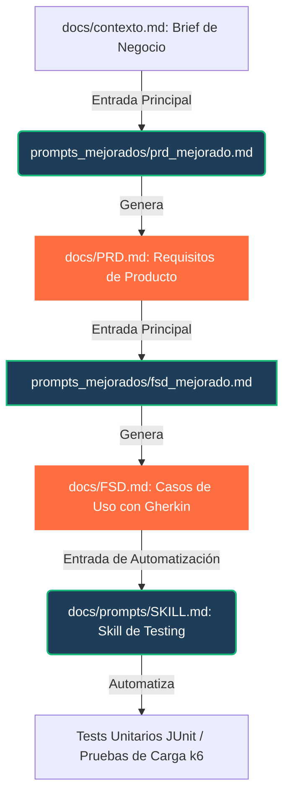

# AI Test Lab: FTGO Architecture Documentation

Este repositorio es un laboratorio de ingeniería y diseño de software asistido por Inteligencia Artificial para el caso de estudio **FTGO (Food To Go)**, inspirado en el libro *Microservices Patterns* de Chris Richardson (Manning, 2019). Su propósito es normalizar y optimizar la generación automatizada y trazable de artefactos arquitectónicos.

---

## 📁 Estructura del Repositorio

*   **`docs/contexto.md`**: El Anexo A oficial con el brief de negocio de FTGO, stakeholders, las 7 capacidades clave, requisitos no funcionales (NFRs) base, y user stories semilla. Representa la **única fuente de verdad** del dominio.
*   **`docs/prompts/`**: Carpeta canónica con plantillas de prompts estructurados y guías del laboratorio.
    *   [PROMPT.md](file:///Users/andresmerida/workspace/githup/ai-test-lab/docs/prompts/PROMPT.md): Plantilla y especificación maestra de 9 secciones que deben cumplir todos los prompts del laboratorio.
    *   [PRD.md](file:///Users/andresmerida/workspace/githup/ai-test-lab/docs/prompts/PRD.md): Prompt estructurado para la generación automática de un PRD ligero de FTGO.
    *   [FSD.md](file:///Users/andresmerida/workspace/githup/ai-test-lab/docs/prompts/FSD.md): Prompt para la generación del documento de especificación funcional.
    *   [ADR.md](file:///Users/andresmerida/workspace/githup/ai-test-lab/docs/prompts/ADR.md): Prompt para la toma y documentación de decisiones arquitectónicas.
    *   [c4.md](file:///Users/andresmerida/workspace/githup/ai-test-lab/docs/prompts/c4.md): Prompt para diagramación arquitectónica C4.
    *   [SKILL.md](file:///Users/andresmerida/workspace/githup/ai-test-lab/docs/prompts/SKILL.md): Especificación de la Skill canónica de pruebas para automatizar tests a partir de Gherkin en FSD.
*   **`prompts_mejorados/`**: Contiene las plantillas de prompts optimizadas que resuelven los retos de diseño del laboratorio con una anatomía estricta de 9 secciones.
    *   [prd_mejorado.md](file:///Users/andresmerida/workspace/githup/ai-test-lab/prompts_mejorados/prd_mejorado.md): Versión mejorada de `PRD.md` con todos los TODOs de dominio resueltos y trazabilidad total.
    *   [fsd_mejorado.md](file:///Users/andresmerida/workspace/githup/ai-test-lab/prompts_mejorados/fsd_mejorado.md): Versión mejorada de `FSD.md` con 5 Casos de Uso atómicos definidos y sintaxis de aceptación Gherkin.
    *   [adr_mejorado.md](file:///Users/andresmerida/workspace/githup/ai-test-lab/prompts_mejorados/adr_mejorado.md): Versión mejorada de `ADR.md` para evaluación rigurosa de trade-offs en la migración.
    *   [c4_mejorado.md](file:///Users/andresmerida/workspace/githup/ai-test-lab/prompts_mejorados/c4_mejorado.md): Versión mejorada de `c4.md` para diagramar contextos y contenedores Mermaid C4 válidos.

---

## 🚀 ¿Cómo Ejecutar los Prompts Mejorados?

Los prompts mejorados de la carpeta `prompts_mejorados/` están diseñados para ser consumidos de manera determinística por cualquier modelo avanzado de lenguaje (como Sonnet, Opus o Gemini 3.5 Pro/Flash).

### 1. Generador de PRD Mejorado (`prd_mejorado.md`)
Genera un documento Markdown impecable que cubre contexto, stakeholders, las 7 capacidades de negocio y $\ge 5$ NFRs citados.
```bash
cat docs/contexto.md prompts_mejorados/prd_mejorado.md | claude "Aplica las instrucciones de la plantilla para generar el archivo docs/PRD.md"
```

### 2. Generador de FSD Mejorado (`fsd_mejorado.md`)
Genera la especificación funcional con 5 Casos de Uso completos (UC-01 al UC-05) y sus respectivos bloques de aceptación Gherkin Dado/Cuando/Entonces.
```bash
cat docs/contexto.md docs/PRD.md prompts_mejorados/fsd_mejorado.md | claude "Genera el archivo docs/FSD.md con los 5 Casos de Uso y sus bloques Gherkin"
```

### 3. Generador de ADR Mejorado (`adr_mejorado.md`)
Genera un ADR detallando $\ge 3$ opciones tecnológicas, trade-offs explícitos e impactos en NFRs.
```bash
# Ejemplo para decidir la estrategia de comunicación IPC (REST vs Kafka)
cat docs/contexto.md docs/PRD.md docs/FSD.md prompts_mejorados/adr_mejorado.md | claude "Produce un ADR aceptado para el Mecanismo IPC predominante en FTGO en docs/adr/0001-ipc.md"
```

### 4. Generador de Diagramas C4 Mejorado (`c4_mejorado.md`)
Produce 2 bloques de diagramación en Mermaid C4 (Nivel 1 de Contexto y Nivel 2 de Contenedores) listos para renderizar.
```bash
cat docs/contexto.md docs/PRD.md prompts_mejorados/c4_mejorado.md | claude "Genera c4_context.mmd y c4_container.mmd con código Mermaid C4 válido"
```

---

## 🔗 Ciclo de Vida del Software y Trazabilidad



Como se muestra en el diagrama:
1.  El **PRD** define los objetivos de negocio, las capacidades de FTGO y los requisitos no funcionales (NFRs).
2.  El **FSD** toma el PRD para mapear estas capacidades a Casos de Uso atómicos documentados con sintaxis de aceptación Gherkin (`Given/When/Then`).
3.  El **SKILL** [SKILL.md](file:///Users/andresmerida/workspace/githup/ai-test-lab/docs/prompts/SKILL.md) procesa los escenarios Gherkin para producir tests automatizados y suites k6 de rendimiento, verificando rigurosamente que los NFRs definidos originalmente en el PRD se cumplan de forma medible.
4.  Los **ADRs** y diagramas **C4** se alinean tanto con las capacidades y NFRs del PRD como con los límites físicos descritos por los contenedores y simulados en la plataforma de testing.

---

## 📊 Métricas de Calidad por Tipo de Artefacto

Cada prompt del laboratorio genera artefactos que deben auto-evaluarse usando un bloque `## Métricas` embebido en la salida. Esto permite comparar la calidad entre ejecuciones sucesivas del mismo prompt (ejecución N vs N-1) de forma objetiva y trazable.

### ¿Cómo usar el bloque `## Métricas`?

Al final de cada artefacto generado (PRD, FSD, ADR, diagramas C4) el modelo inserta automáticamente una tabla de métricas con el siguiente formato:

```markdown
## Métricas

**#️⃣ Ejecución**: `[N]`
**🔖 Prompt**: `[ID-PROMPT]` — versión `[vX.X-mejorada]`

| Nombre de la métrica | Valor | Insights |
|---|---|---|
| Nombre de la métrica | valor calculado | observación accionable |
```

> **Comparación entre ejecuciones**: Incrementa el número de ejecución (`N`) en cada nueva corrida del prompt y compara la tabla de métricas con la ejecución anterior. Las métricas que no alcancen el umbral mínimo requieren ajuste del prompt o del contexto de entrada.

---

### Tabla Maestra: Métricas vs Tipo de Documento

| Métrica | ID | PRD | FSD | ADR | C4 | Lógica de cálculo | Umbral mínimo |
|---|---|:---:|:---:|:---:|:---:|---|---|
| **Completitud de secciones** | `sections_coverage` | ✅ | — | — | — | `secciones_presentes / secciones_requeridas` × 100 | 5/5 (100%) |
| **Cobertura de capacidades** | `capabilities_coverage` | ✅ | — | — | — | `capacidades_documentadas / 7` × 100 | 7/7 (100%) |
| **Trazabilidad de NFRs** | `nfr_traceability_rate` | ✅ | — | — | — | `NFRs_con_cita_Brief / total_NFRs` × 100 | 100% |
| **NFRs con métrica cuantitativa** | `nfr_quantitative_rate` | ✅ | — | — | — | `NFRs_con_valor_numérico / total_NFRs` × 100 | 100% |
| **Completitud de Casos de Uso** | `uc_coverage` | — | ✅ | — | — | `UCs_completos / 5` × 100 | 5/5 (100%) |
| **Tasa de bloques Gherkin válidos** | `gherkin_syntax_pass_rate` | — | ✅ | — | — | `UCs_con_Gherkin_válido / 5` × 100 | 100% |
| **Flujos alternativos por UC** | `alt_flows_rate` | — | ✅ | — | — | `UCs_con_≥2_flujos_alt / 5` | 5/5 |
| **Trazabilidad UC→US/Capacidad** | `uc_traceability_rate` | — | ✅ | — | — | `UCs_con_referencia_PRD_o_Brief / 5` × 100 | 100% |
| **Fixtures de datos realistas** | `realistic_fixtures` | — | ✅ | — | — | Revisión manual: datos del dominio FTGO (BOB, restaurantes, IDs) | Sí |
| **Número de opciones evaluadas** | `options_count` | — | — | ✅ | — | Conteo directo de opciones en la sección "Opciones Consideradas" | ≥ 3 |
| **Balance consecuencias** | `tradeoff_honesty_score` | — | — | ✅ | — | `consecuencias_negativas / consecuencias_positivas` | ≥ 1.0 |
| **Citaciones al libro** | `book_citation_count` | — | — | ✅ | — | Conteo de referencias a capítulos de *Microservices Patterns* | ≥ 1 |
| **Impacto en NFRs documentado** | `nfr_impact_rate` | — | — | ✅ | — | `opciones_con_impacto_NFR / total_opciones` × 100 | 100% |
| **Alineación con Strangler Fig** | `migration_alignment` | — | — | ✅ | — | Revisión manual: la decisión menciona compatibilidad incremental | Sí |
| **Éxito de render Mermaid** | `mermaid_render_success` | — | — | — | ✅ | Compilación exitosa de ambos bloques `.mmd` en visor Mermaid C4 | 2/2 (100%) |
| **N° de contenedores (Nivel 2)** | `container_count_metric` | — | — | — | ✅ | Conteo de elementos `Container`, `ContainerDb`, `ContainerQueue` en el diagrama | 6–12 |
| **Protocolos en relaciones** | `protocol_completeness` | — | — | — | ✅ | `Rel_con_4º_argumento / total_Rel_Nivel2` × 100 | 100% |
| **Separación estricta de niveles** | `level_separation_valid` | — | — | — | ✅ | Revisión manual: Nivel 1 sin contenedores, Nivel 2 con `System_Boundary` | Sí |
| **Alineación con ADRs** | `adr_alignment` | — | — | — | ✅ | Revisión manual: Kafka + DB-per-service reflejados | Sí |
| **Ausencia de placeholders** | `placeholder_free` | ✅ | ✅ | — | — | Búsqueda de patrones `[...]`, `TODO`, `...` en el output | Sí (0 encontrados) |
| **Referencia a SKILL.md** | `skill_link_present` | ✅ | — | — | — | Búsqueda de la cadena `docs/prompts/SKILL.md` en el output | ≥ 1 mención |
| **Trazabilidad hacia QA** | `skill_traceability` | — | — | — | ✅ | Conteo de relaciones Person→Container y Container→System_Ext en Nivel 2 | ≥ 4 relaciones |
| **Trazabilidad PRD/FSD** | `source_traceability` | — | — | ✅ | — | Revisión manual: ADR cita restricciones de `docs/PRD.md` o `docs/FSD.md` | Sí |
| **Palabras totales del output** | `word_count` | ✅ | — | — | — | Conteo de palabras del artefacto generado | 1500–3000 palabras |

### Leyenda
- ✅ = métrica aplicable a este tipo de artefacto
- — = métrica no aplicable

---

### Comparación Entre Ejecuciones (N vs N-1)

Para comparar la calidad entre ejecuciones sucesivas del mismo prompt:

1. **Registra** los valores de la tabla `## Métricas` de cada ejecución en una hoja de cálculo o log.
2. **Compara** las métricas entre la ejecución `N` y la `N-1`. Métricas que mejoran indican que el prompt o el contexto de entrada fue ajustado correctamente.
3. **Identifica regresiones**: Si una métrica cae por debajo del umbral, revisa el prompt correspondiente (sección `## 1. Anatomía del prompt`) y ajusta las instrucciones o el contexto.
4. **Documenta** los ajustes en la tabla `## 8. Changelog` del prompt, con fecha, autor y descripción del cambio realizado.

```
Ejemplo de seguimiento multi-ejecución:

| Métrica              | Ejecución #1 | Ejecución #2 | Delta  | Estado   |
|----------------------|-------------|-------------|--------|----------|
| sections_coverage    | 4/5         | 5/5         | +1     | ✅ Mejora |
| nfr_traceability_rate| 80%         | 100%        | +20%   | ✅ Mejora |
| placeholder_free     | No          | Sí          | —      | ✅ Mejora |
| capabilities_coverage| 7/7         | 7/7         | 0      | ✅ Estable|
```