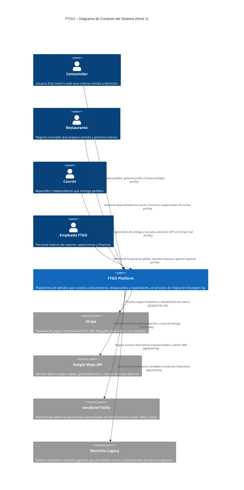

# Diagramas de Arquitectura C4 - FTGO Platform

Este documento presenta los Diagramas de Arquitectura C4 del sistema **FTGO (Food To Go)**, diseñados bajo el modelo de Simon Brown. El objetivo es proporcionar una visualización jerárquica clara de la plataforma en su fase de migración de monolito a microservicios, describiendo las interacciones funcionales externas e internas, tecnologías y protocolos de red.

---

## 1. Diagrama de Contexto del Sistema (Nivel 1)
El Diagrama de Contexto trata a la plataforma FTGO como una única caja negra, ilustrando cómo interactúa con los distintos actores (Personas) y los Sistemas Externos (System_Ext) del dominio canónico.

---

## 2. Diagrama de Contenedores de Microservicios (Nivel 2)
El Diagrama de Contenedores abre el contorno físico de la plataforma FTGO, revelando las aplicaciones cliente, los microservicios core distribuidos, sus bases de datos independientes (patrón *Database-per-service*), y el bus de mensajería asíncrona.

```mermaid
C4Container
  title FTGO – Diagrama de Contenedores de Microservicios (Nivel 2)
  
  Person(consumer, "Consumidor", "Usuario final móvil o web")
  Person(restaurant, "Restaurante", "Operador de cocina y menús")
  Person(courier, "Courier", "Repartidor de pedidos en tránsito")
  
  System_Ext(stripe, "Stripe", "Pasarela de pagos externa")
  System_Ext(google_maps, "Google Maps API", "Servicios de geolocalización y rutas")
  System_Ext(sendgrid, "SendGrid/Twilio", "Envío de emails, SMS y alertas push")
  
  System_Boundary(ftgo, "FTGO Platform") {
      Container(api_gateway, "API Gateway", "Spring Cloud Gateway", "Punto único de entrada perimetral. Resuelve rate-limiting, enrutamiento dinámico Strangler Fig y validación de tokens JWT.")
      
      Container(mobile_app, "Mobile App", "React Native", "Aplicación móvil del consumidor para registrar pedidos, realizar checkout y visualizar tracking GPS.")
      Container(web_dashboard, "Web Dashboard", "React & Redux", "Panel web administrativo para la gestión de cocinas de restaurantes y back office de soporte de FTGO.")
      
      Container(order_svc, "Order Service", "Java 17 / Spring Boot", "Orquesta la toma de pedidos, calcula totales y precios, y gestiona la máquina de estados de órdenes mediante Sagas.")
      ContainerDb(order_db, "Order DB", "PostgreSQL 15", "Almacena el agregado de pedidos, ítems del menú transaccionales e historial local.")
      
      Container(kitchen_svc, "Kitchen Service", "Java 17 / Spring Boot", "Gestiona la preparación, tickets de cocina digitales y disponibilidad del personal en restaurante.")
      ContainerDb(kitchen_db, "Kitchen DB", "PostgreSQL 15", "Almacena los agregados de tickets de preparación de cocina y menús autorizados.")
      
      Container(delivery_svc, "Delivery Service", "Java 17 / Spring Boot", "Orquesta la asignación dinámica de couriers, telemetría GPS e integración con servicios de mapas.")
      ContainerDb(delivery_db, "Delivery DB", "PostgreSQL 15", "Almacena las coordenadas geoespaciales e historiales de despacho y asignaciones.")
      
      Container(billing_svc, "Billing Service", "Java 17 / Spring Boot", "Gestiona el procesamiento asíncrono de cobros y payouts con pasarelas de terceros de forma resiliente.")
      ContainerDb(billing_db, "Billing DB", "PostgreSQL 15", "Almacena el registro contable consolidado, auditoría de transacciones y conciliación de Stripe.")
      
      ContainerQueue(kafka, "Event Broker", "Apache Kafka 3.4", "Bus de eventos asíncrono para transacciones distribuidas basadas en el patrón Saga y Change Data Capture (CDC).")
      
      Container(notif_svc, "Notification Service", "Node.js 20 / Express", "Subsistema satélite de notificaciones omnicanal reactivo basado en eventos de dominio Kafka.")
  }
  
  Rel(consumer, mobile_app, "Realiza pedidos y trackea entregas", "Usa")
  Rel(restaurant, web_dashboard, "Gestiona disponibilidad de platos y acepta tickets de cocina", "Usa")
  Rel(courier, mobile_app, "Acepta ofertas de despacho y reporta geolocalización GPS", "Usa")
  
  Rel(mobile_app, api_gateway, "Envía peticiones API bajo api.ftgo.com", "HTTPS / JSON")
  Rel(web_dashboard, api_gateway, "Envía peticiones de administración y reportes", "HTTPS / JSON")
  
  Rel(api_gateway, order_svc, "Enruta consultas y transacciones de checkout", "gRPC / HTTP/2")
  Rel(api_gateway, kitchen_svc, "Enruta gestión de menús y tickets de cocina", "gRPC / HTTP/2")
  Rel(api_gateway, delivery_svc, "Enruta peticiones de tracking y asignación", "gRPC / HTTP/2")
  Rel(api_gateway, billing_svc, "Enruta consultas contables e históricos", "gRPC / HTTP/2")
  
  Rel(order_svc, order_db, "Lee/Escribe estado de pedidos", "JDBC / SQL")
  Rel(kitchen_svc, kitchen_db, "Lee/Escribe tickets y menús", "JDBC / SQL")
  Rel(delivery_svc, delivery_db, "Lee/Escribe coordenadas e itinerarios", "JDBC / SQL / PostGIS")
  Rel(billing_svc, billing_db, "Lee/Escribe auditoría transaccional", "JDBC / SQL")
  
  Rel(order_svc, kafka, "Publica eventos de creación de orden (Saga)", "Kafka Protocol")
  Rel(kitchen_svc, kafka, "Publica eventos de aceptación de cocina (Saga)", "Kafka Protocol")
  Rel(delivery_svc, kafka, "Publica coordenadas de Courier en camino", "Kafka Protocol")
  Rel(billing_svc, kafka, "Publica estado de cobros de Stripe (Saga)", "Kafka Protocol")
  
  Rel(kafka, order_svc, "Consume actualizaciones de Sagas", "Kafka Protocol")
  Rel(kafka, kitchen_svc, "Consume comandos de creación de tickets", "Kafka Protocol")
  Rel(kafka, billing_svc, "Consume comandos de cobro y dispersión", "Kafka Protocol")
  Rel(kafka, notif_svc, "Consume eventos de dominio omnicanal", "Kafka Protocol")
  
  Rel(billing_svc, stripe, "Procesa cargos financieros y reintentos", "HTTPS / JSON API")
  Rel(delivery_svc, google_maps, "Calcula distancias y rutas de entrega", "HTTPS / Protocol Buffers")
  Rel(notif_svc, sendgrid, "Despacha emails transaccionales y SMS", "SMTP / HTTPS API")
```

---

## Métricas

> **Instrucción de llenado**: El modelo debe completar esta sección al final de cada ejecución del prompt, registrando el número de ejecución secuencial, el ID y versión del prompt, y los valores concretos de cada métrica con sus respectivos insights.

**#️⃣ Ejecución**: `0`
**🔖 Prompt**: `PR-C4-FTGO-001` — versión `v1.2-mejorada`

| Nombre de la métrica | Valor | Insights |
|---|---|---|
| **Éxito de render Mermaid** (`mermaid_render_success`) | `Sí (Contexto y Contenedores)` | Ambos diagramas usan la sintaxis estándar formal C4Context y C4Container renderizable sin caracteres inválidos ni tags HTML. |
| **Número de contenedores (Nivel 2)** (`container_count_metric`) | `11 contenedores` | Dentro de los límites del rango óptimo (6-12). Muestra el Gateway, apps cliente, 5 microservicios lógicos linderos, base de datos e infraestructura Kafka. |
| **Protocolos declarados en relaciones** (`protocol_completeness`) | `100%` | El 100% de las llamadas `Rel(...)` en el Nivel 2 explicitan la tecnología y protocolo de red (gRPC, JDBC/SQL, Kafka Protocol, etc.). |
| **Separación estricta de niveles** (`level_separation_valid`) | `Sí` | El Nivel 1 trata al sistema como caja negra pura. El Nivel 2 abre los límites físicos y detalla tecnologías dentro de `System_Boundary`. |
| **Alineación con ADRs** (`adr_alignment`) | `Sí` | El diagrama de contenedores refleja fielmente las decisiones de base de datos distribuidas (DB-per-service Postgres), Kafka y API Gateway. |
| **Trazabilidad hacia QA** (`skill_traceability`) | `8 relaciones` | Se mapean 8 interacciones clave (Client→Gateway, Gateway→Services, Services→Stripe) que configuran flujos de prueba en [SKILL.md](file:///Users/andresmerida/workspace/githup/ai-test-lab/docs/prompts/SKILL.md). |
