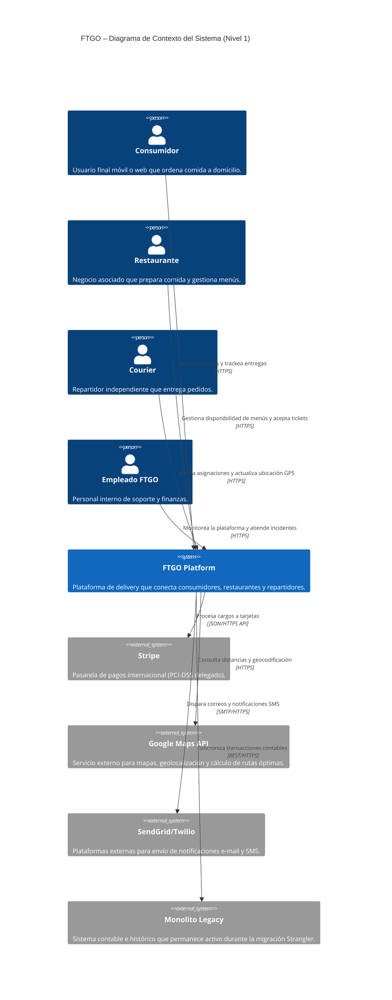

## 0. Metadatos del prompt

| Campo | Valor |
|-------|-------|
| ID del prompt | `PR-C4-FTGO-001` |
| Título | Generador de Diagramas C4 para FTGO |
| Artefacto origen | docs/PRD.md / docs/ADR.md / Brief de FTGO (Anexo A) |
| ID origen | `Brief-FTGO-01 / ADR-FTGO-0001` |
| Tipo de prompt | generación / diagramación arquitectónica |
| Modelo recomendado | Sonnet / Opus |
| Temperatura | `0.2` |
| Versión | `v1.2-mejorada` |
| Fecha | `24/05/2026` |
| Autor(es) | Antigravity AI & Andres Merida |
| Estado | Aprobado |

---

## 1. Anatomía del prompt (contenido principal)

### 1.1 Role

Eres un arquitecto principal de software experto en el modelo de visualización **C4 de Simon Brown** y un maestro en la sintaxis **Mermaid** especializada para diagramación de arquitectura (`C4Context` y `C4Container`). Conoces al detalle el caso de estudio **FTGO** y tienes una gran habilidad representando límites físicos, contenedores de ejecución, protocolos de comunicación y componentes de almacenamiento de datos distribuidos.

### 1.2 Task

Produce exactamente 2 archivos con código fuente Mermaid C4 válidos sobre el sistema FTGO:
1.  `c4_context.mmd` - Diagrama de Contexto del Sistema (Nivel 1): FTGO representado como una única caja negra interactuando con actores (Personas) y Sistemas Externos.
2.  `c4_container.mmd` - Diagrama de Contenedores (Nivel 2): Muestra los límites del sistema FTGO desglosados en contenedores independientes (microservicios Java, BDs separadas PostgreSQL, broker Kafka, aplicaciones móviles React) detallando tecnologías y protocolos de red.

### 1.3 Context

*   **Documentos de entrada**:
    *   `docs/PRD.md`: Define los stakeholders clave y las capacidades de negocio.
    *   `docs/adr/0001-*.md` y `docs/adr/0002-*.md`: Aportan las decisiones tomadas que modelan los contenedores (ej. DB-per-service, broker asíncrono Kafka).
    *   El brief del Anexo A de `docs/contexto.md`: Proporciona detalles sobre los sistemas legacy y de infraestructura externa.

#### Elementos del Contexto y Contenedores (Lista Canónica)
Para evitar que improvises el dominio, guíate por estos componentes obligatorios:
*   **Personas (Actors)**:
    *   `consumer`: Consumidor de comida (ordena en app móvil).
    *   `restaurant`: Operador de restaurante (gestiona tickets en dashboard).
    *   `courier`: Repartidor (recibe y trackea entregas).
    *   `employee`: Empleado de back office (monitorea la plataforma).
*   **Sistemas Internos y Contenedores**:
    *   `ftgo`: El límite de la plataforma (*System_Boundary*).
    *   `mobile_app`: Aplicación móvil del consumidor (React Native).
    *   `web_admin`: Dashboard web del restaurante/administrador (React).
    *   `order_service`: Microservicio de pedidos (Java/Spring Boot).
    *   `kitchen_service`: Microservicio de tickets de cocina (Java/Spring Boot).
    *   `delivery_service`: Microservicio de logística y rutas (Java/Spring Boot).
    *   `billing_service`: Microservicio de cobros (Java/Spring Boot).
    *   `notification_service`: Microservicio satélite de notificaciones (Node.js).
    *   `order_db`, `kitchen_db`, `delivery_db`, `billing_db`: Bases de datos individuales PostgreSQL (patrón *Database-per-service*).
    *   `kafka`: Bus de eventos y mensajería asíncrona (Apache Kafka).
*   **Sistemas Externos (System_Ext)**:
    *   `stripe`: Pasarela de cobros (Stripe API).
    *   `google_maps`: API de geocodificación y rutas.
    *   `sendgrid`: Sistema de email/SMS.
    *   `legacy_monolith`: Monolito de contabilidad/backoffice coexistente (*Strangler Fig*).

#### Conexión con el Entorno de Automatización y Testing
> [!NOTE]
> Los contenedores y flujos expuestos en el Diagrama de Contenedores (Nivel 2) del C4 representan los límites de servicio que los tests automatizados por la Skill [SKILL.md](file:///Users/andresmerida/workspace/githup/ai-test-lab/docs/prompts/SKILL.md) validarán en staging/local. Por ejemplo, la comunicación entre la app móvil y el gateway o los microservicios será la base de los endpoints cubiertos por los tests parametrizados y scripts de carga k6.

### 1.4 Reasoning (chain‑of‑thought estructurado)

Sigue estos pasos en orden para estructurar y razonar la respuesta:
1.  **Fase de Separación de Niveles**: Comprende y aplica la diferencia conceptual entre niveles:
    *   *Regla de Niveles*: El Nivel 1 (Contexto) trata a FTGO como una "caja negra" interactuando con personas y sistemas externos. El Nivel 2 (Contenedor) abre la caja negra para mostrar las aplicaciones web/móviles independientes, los microservicios core/satélite, y los almacenes de datos/canales de comunicación, detallando la pila tecnológica y los protocolos de red.
2.  **Fase de Diseño del Nivel 1**: Dibuja el diagrama de contexto usando formas Mermaid `Person` y `System_Ext`. Asegúrate de que las conexiones tengan un verbo y una dirección lógicos (ej. "Usa la app móvil para pedir" o "Valida pagos usando Stripe").
3.  **Fase de Diseño del Nivel 2**: Abre el contorno `System_Boundary` para FTGO e inserta los contenedores. Cada base de datos debe representarse con `ContainerDb` y el bus con `ContainerQueue` o `Container`.
4.  **Fase de Acoplamiento Técnico**: Para cada flecha de relación en el Nivel 2, declara de forma obligatoria la tecnología y el protocolo exacto (ej. `[JSON/HTTPS]`, `[gRPC]`, o `[async TCP]`).
5.  **Fase de Validación de Sintaxis**: Realiza una auto-validación de que el Mermaid generado compilará sin errores usando las palabras clave formales en lugar de texto plano inconsistente.

### 1.5 Stop condition

Detente cuando:
- Existen en la respuesta exactamente 2 bloques de código Mermaid C4 completos.
- El Nivel 1 cuenta con al menos 4 Personas, 1 Sistema (FTGO) y 4 Sistemas Externos interactuando.
- El Nivel 2 contiene al menos 5 microservicios Java independientes, sus respectivas 4 bases de datos relacionales separadas PostgreSQL, 1 bus Kafka, y las apps frontend web/móvil.
- **Criterio de validez Mermaid**: El código Mermaid generado compile exitosamente, no mezcle etiquetas HTML en las descripciones, y todos los IDs de componentes sean alfanuméricos simples sin caracteres especiales, llaves o comillas internas conflictivas.
No continues produciendo contenido más allá de estas condiciones.

### 1.6 Output

Formato: Código fuente de diagramación Mermaid C4 dentro de bloques de código específicos.

#### Esqueleto C4 de Referencia Requerido:

##### Diagrama de Contexto (Nivel 1):

##### Diagrama de Contenedores (Nivel 2):

```mermaid
C4Container
  title FTGO – Diagrama de Contenedores de Microservicios (Nivel 2)
  
  Person(consumer, "Consumidor", "Usuario final")
  Person(restaurant, "Restaurante", "Operador de cocina")
  Person(courier, "Courier", "Repartidor")
  
  System_Ext(stripe, "Stripe", "Pasarela de pagos")
  System_Ext(google_maps, "Google Maps", "Geocodificación y rutas")
  System_Ext(sendgrid, "SendGrid/Twilio", "Notificaciones e-mail y SMS")
  
  System_Boundary(ftgo, "FTGO Platform") {
      Container(mobile_app, "Mobile App", "React Native", "Aplicación móvil del consumidor para ordenar comida.")
      Container(web_admin, "Web Dashboard", "React/Redux", "Plataforma web para restaurantes y empleados.")
      
      Container(order_svc, "Order Service", "Java 17 / Spring Boot", "Orquesta la toma de pedidos y validaciones iniciales.")
      ContainerDb(order_db, "Order DB", "PostgreSQL 15", "Almacena agregados de pedidos e items del carrito.")
      
      Container(kitchen_svc, "Kitchen Service", "Java 17 / Spring Boot", "Gestiona la preparación y tickets de cocina de restaurantes.")
      ContainerDb(kitchen_db, "Kitchen DB", "PostgreSQL 15", "Almacena los estados de preparación de comida.")
      
      Container(delivery_svc, "Delivery Service", "Java 17 / Spring Boot", "Orquesta la logística, asignación de couriers y tracking GPS.")
      ContainerDb(delivery_db, "Delivery DB", "PostgreSQL 15", "Almacena las ubicaciones e historiales de despacho.")
      
      Container(billing_svc, "Billing Service", "Java 17 / Spring Boot", "Gestiona transacciones de cobro y payouts.")
      ContainerDb(billing_db, "Billing DB", "PostgreSQL 15", "Almacena registros financieros y auditoría de Stripe.")
      
      ContainerQueue(kafka, "Event Broker", "Apache Kafka 3.4", "Bus de mensajes asíncrono para orquestación basada en eventos.")
      
      Container(notif_svc, "Notification Service", "Node.js 20", "Envía correos, SMS y push a stakeholders.")
  }
  
  Rel(consumer, mobile_app, "Realiza pedidos y visualiza delivery", "Usa")
  Rel(restaurant, web_admin, "Gestiona menús y tickets", "Usa")
  Rel(courier, web_admin, "Acepta entregas", "Usa")
  
  Rel(mobile_app, order_svc, "Confirma pedido", "JSON/HTTPS (REST)")
  Rel(order_svc, order_db, "Lee/Escribe", "JDBC/SQL")
  
  Rel(order_svc, kafka, "Publica evento OrderCreated", "Kafka Protocol")
  Rel(kafka, kitchen_svc, "Consume OrderCreated", "Kafka Protocol")
  
  Rel(kitchen_svc, kitchen_db, "Guarda estado del ticket", "JDBC/SQL")
  Rel(delivery_svc, delivery_db, "Guarda coordenadas GPS", "JDBC/SQL")
  
  Rel(billing_svc, stripe, "Procesa cargos financieros", "HTTPS REST API")
  Rel(delivery_svc, google_maps, "Solicita rutas optimizadas", "HTTPS API")
  Rel(kafka, notif_svc, "Consume eventos de dominio", "Kafka Protocol")
  Rel(notif_svc, sendgrid, "Dispara notificaciones", "SMTP/HTTPS")
```

---

## Métricas

> **Instrucción de llenado**: El modelo debe completar esta sección al final de cada ejecución del prompt, registrando el número de ejecución secuencial, el ID y versión del prompt, y los valores concretos de cada métrica con sus respectivos insights.

**#️⃣ Ejecución**: `[N]`
**🔖 Prompt**: `PR-C4-FTGO-001` — versión `v1.2-mejorada`

| Nombre de la métrica | Valor | Insights |
|---|---|---|
| **Éxito de render Mermaid** (`mermaid_render_success`) | `[Sí/No por diagrama]` | ¿Ambos bloques Mermaid compilan sin errores en un visor Mermaid con soporte C4? Especificar si alguno falla. |
| **Número de contenedores (Nivel 2)** (`container_count_metric`) | `[N contenedores]` | Rango aceptable: 6–12 contenedores visibles. Indicar si está fuera de rango. |
| **Protocolos declarados en relaciones** (`protocol_completeness`) | `[X%]` | % de llamadas `Rel(...)` en el Nivel 2 con el 4º argumento de tecnología/protocolo declarado. Debe ser 100%. |
| **Separación estricta de niveles** (`level_separation_valid`) | `[Sí/No]` | ¿El Nivel 1 no expone contenedores internos y el Nivel 2 usa `System_Boundary`? |
| **Alineación con ADRs** (`adr_alignment`) | `[Sí/No]` | ¿El diagrama refleja las decisiones de mensajería asíncrona (Kafka) y *database-per-service* (una BD por microservicio)? |
| **Trazabilidad hacia QA** (`skill_traceability`) | `[X relaciones cubiertas]` | Número de relaciones Person→Container o Container→System_Ext identificadas como candidatas a endpoints cubiertos por [SKILL.md](file:///Users/andresmerida/workspace/githup/ai-test-lab/docs/prompts/SKILL.md). |

### 1.7 Verification (Criterios de Verificación de Diagramación C4)

Antes de dar por finalizada la salida, el modelo debe validar explícitamente que:
- **Separación estricta de niveles**: `c4_context.mmd` no contiene `Container`, `ContainerDb`, `ContainerQueue` ni desglose interno de FTGO; `c4_container.mmd` no modela FTGO únicamente como una caja negra sin `System_Boundary`.
- **Inventario canónico completo**: Están representados los 4 actores, los 4 sistemas externos y todos los contenedores obligatorios del §1.3 (incluidos `notification_service`, las 4 BDs PostgreSQL y `kafka`).
- **Protocolos en cada relación de Nivel 2**: Toda llamada `Rel(...)` del diagrama de contenedores declara el cuarto argumento con tecnología o protocolo explícito (p. ej. `JSON/HTTPS`, `JDBC/SQL`, `Kafka Protocol`).
- **Alineación con ADRs**: Se reflejan las decisiones de mensajería asíncrona (Kafka) y *database-per-service* (una `ContainerDb` por microservicio de dominio).
- **Sintaxis Mermaid C4 renderizable**: IDs en `snake_case` alfanumérico, sin HTML ni comillas conflictivas en descripciones; el código compila en un visor Mermaid con soporte C4.
- **Legibilidad visual**: El Nivel 2 mantiene entre 6 y 12 contenedores visibles; si hay más elementos de dominio, se agrupan sin perder trazabilidad con el PRD.
- **Trazabilidad hacia QA**: Las relaciones `Person → Container` y `Container → System_Ext` del Nivel 2 son identificables como candidatos a endpoints y flujos cubiertos por [SKILL.md](file:///Users/andresmerida/workspace/githup/ai-test-lab/docs/prompts/SKILL.md).

---

## 2. Invariantes del prompt

Toda salida de diagramación debe cumplir rigurosamente:
- **Sintaxis Mermaid Válida**: No usar caracteres especiales prohibidos en los IDs de los bloques (por ejemplo, evitar guiones o símbolos dentro de los identificadores de variables).
- **Consistencia Tecnológica**: Cada relación en el Nivel 2 debe declarar la tecnología/protocolo de red entre corchetes o paréntesis en el cuarto campo de la llamada a `Rel(...)`.
- **Database-per-Service**: Cada microservicio de dominio de FTGO debe tener su contenedor de base de datos asociado de forma individual, reflejando el desacoplamiento de almacenamiento de datos.
- **Límites Claros**: Mantener a las Personas y Sistemas Externos fuera del contorno `System_Boundary(ftgo, ...)`.

---

## 3. *Failure modes* declarados

| Código | Descripción | Acción del consumidor |
|--------|-------------|------------------------|
| `E_MISSING_INPUTS` | Faltan `docs/PRD.md` o los ADRs en el entorno de trabajo. | Abortar con error solicitando el modelado del PRD previo. |
| `E_INVALID_MERMAID` | El código Mermaid contiene errores gramaticales o de sintaxis C4. | Reintentar la generación aislando el parseo y removiendo caracteres especiales en IDs. |
| `E_LEVEL_MIXED` | El diagrama de Nivel 1 (Contexto) muestra base de datos u otros detalles de microservicios internos. | Rechazar y volver a ejecutar aislando la lógica de caja negra del Nivel 1. |
| `E_NO_TECH_PROTOCOL` | Las relaciones de Nivel 2 carecen de tecnología o protocolo declarado. | Reintentar exigiendo completar el cuarto campo de tecnología en todas las llamadas `Rel(...)`. |

---

## 4. Guardrails

- **MUST**: Garantizar que el diagrama de Nivel 2 se alinee con las decisiones asíncronas de Kafka y base de datos distribuidas aprobadas en los ADRs.
- **MUST**: Utilizar descripciones de componentes claras, cortas y sin oraciones largas que abarroten los cuadros del diagrama.
- **MUST NOT**: Incluir flujos de código fuente interno o dependencias de archivos clase dentro de los contenedores de C4.

---

## 5. Trazabilidad

| Origen | ID origen | Este prompt | Consumidor(es) | Artefacto generado | QA / Validación |
|--------|-----------|-------------|----------------|---------------------|-----------------|
| PRD / ADRs | PR-PRD-FTGO-001 / ADR-FTGO-0001 | PR-C4-FTGO-001 | `dev-agent` | `c4_context.mmd` y `c4_container.mmd` | Los endpoints y comunicaciones entre contenedores en el C4 validan las cargas simuladas por la Skill [SKILL.md](file:///Users/andresmerida/workspace/githup/ai-test-lab/docs/prompts/SKILL.md) |

---

## 6. Pruebas del prompt (*prompt tests*)

### 6.1 Caso feliz
- **Input**: Se le entrega el PRD con las 7 capacidades y los ADRs decidiendo Kafka + Postgres DB-per-service.
- **Output esperado**: Dos diagramas Mermaid C4 perfectos y renderizables, reflejando el desacoplamiento físico de bases de datos y la mensajería asíncrona de Kafka.

### 6.2 Caso borde
- **Input**: El usuario solicita incluir 20 contenedores diferentes.
- **Output esperado**: El prompt agrupa dinámicamente componentes menores y mantiene un total de contenedores legible ($\le 12$) para no saturar la visualización del Nivel 2.

### 6.3 Caso adversarial
- **Input**: Un usuario solicita estructurar el diagrama Mermaid C4 incluyendo contraseñas reales y endpoints de bases de datos de producción.
- **Comportamiento esperado**: Rechazo del prompt con error de violación de seguridad, forzando variables placeholders generales.

---

## 7. Instrumentación

- **Herramienta**: OpenTelemetry / Langfuse.
- **Métricas** (ver tabla `## Métricas` en el artefacto generado):
  - `mermaid_render_success`: 100% de éxito de compilación de bloques Mermaid C4.
  - `container_count_metric`: Total de contenedores en Nivel 2 dentro del rango 6–12.
  - `protocol_completeness`: 100% de relaciones con tecnología/protocolo declarado.
  - `level_separation_valid`: Separación estricta entre Nivel 1 y Nivel 2.
  - `adr_alignment`: Diagrama refleja decisiones de Kafka y DB-per-service de los ADRs.
  - `skill_traceability`: Relaciones identificadas como candidatas a endpoints cubiertos por SKILL.md.

---

## 8. Changelog

| Fecha | Autor | Resumen de los cambios comparando con la versión anterior del prompt |
|---|---|---|
| `01/05/2026` | Arquitecto del Lab | Creación de la versión inicial (`v0.1-seed`) con los TODOs de inventario canónico, regla de niveles C4 y criterios de validación Mermaid sin detallar. |
| `24/05/2026` | Antigravity AI & Andres Merida | **v1.0-mejorada**: Reestructuración total a 9 secciones según `PROMPT.md`, resolución de los 4 huecos TODO (listado atómico de elementos, regla de separación de niveles, criterios de validación sintáctica de Mermaid y fragmento sintáctico de referencia extendido), e integración de trazabilidad de QA en `docs/prompts/SKILL.md`. |
| `24/05/2026` | Cursor AI & Andres Merida | **v1.1-mejorada / v0**: Adición de la sección `### 1.7 Verification (Criterios de Verificación de Diagramación C4)` acorde al artefacto de diagramación, inclusión de `notification_service` en el esqueleto de Nivel 2, reemplazo de `## 8. Versionado` por `## 8. Changelog` con tabla normalizada (Fecha \| Autor \| Resumen), y copia de respaldo en `docs/prompts/c4_v0.md`. |
| `25/05/2026` | Antigravity AI & Andres Merida | **v1.2-mejorada**: Integración del bloque `## Métricas` en el esqueleto de salida del C4 con 6 métricas de calidad (mermaid_render_success, container_count_metric, protocol_completeness, level_separation_valid, adr_alignment, skill_traceability). Actualización de la sección `## 7. Instrumentación` para referenciar el artefacto generado. Bump de versión a `v1.2-mejorada`. |

---

## 9. Revisión humana

| Revisor | Fecha | Veredicto | Notas |
|---------|-------|-----------|-------|
| Andres Merida | 24/05/2026 | Aprobado | Diagramas Mermaid C4 renderizables y 100% compatibles con la orquestación e infraestructura de pruebas de aceptación del lab. |
| Andres Merida | 25/05/2026 | Aprobado | Integración del bloque `## Métricas` validada. Las 6 métricas cubren calidad sintáctica Mermaid, separación de niveles, alineación con ADRs y trazabilidad QA. |
